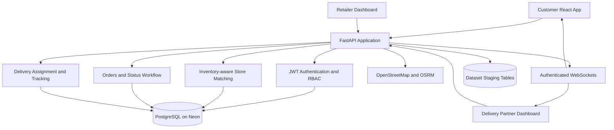

<div align="center">

# Dukaan2Door

### Hyperlocal Direct Delivery Platform for Local Retailers

Customer ordering, store matching, retailer fulfillment, delivery assignment,
route tracking, and real-time delivery updates in one integrated system.

[](backend/)
[](frontend/)
[](https://neon.tech/)
[](backend/alembic/)
[](https://project-osrm.org/)
[](#testing)

</div>

---

## Table of Contents

- [Overview](#overview)
- [Core Workflow](#core-workflow)
- [System Architecture](#system-architecture)
- [Technology Stack](#technology-stack)
- [Implemented Capabilities](#implemented-capabilities)
- [Data Architecture](#data-architecture)
- [Local Setup](#local-setup)
- [Demo Credentials and Story](#demo-credentials-and-story)
- [Testing](#testing)
- [Deployment](#deployment)
- [Documentation](#documentation)

## Overview

Dukaan2Door is a hyperlocal grocery and essentials delivery platform that
connects customers with nearby local retailers. A customer selects products,
shares a delivery location, and places an order. The backend selects an
eligible store using distance and inventory, while retailer and delivery
partner workflows move the order through fulfillment to delivery.

The platform is designed around a direct local-store experience rather than a
large marketplace. The customer catalog can be scoped to the active demo store,
while the backend retains radius-based matching for multiple eligible stores.

## Core Workflow

```text
Customer
  -> Location and product selection
  -> Cart and checkout
  -> Order creation
  -> 2 km store matching, then 5 km fallback
  -> Inventory lock and decrement
  -> Retailer accepts and prepares order
  -> Ready for pickup
  -> Delivery partner assignment
  -> Partner accepts and picks up order
  -> OSRM route and live tracking
  -> Customer delivery
  -> Order completed
```

Order lifecycle:

```text
RECEIVED -> ACCEPTED -> PREPARING -> READY_FOR_PICKUP
          -> OUT_FOR_DELIVERY -> DELIVERED
```

## System Architecture



## Technology Stack

| Layer | Technology |
| --- | --- |
| Customer and operations frontend | React, TypeScript, Vite, Tailwind CSS |
| UI components | Reusable local UI components and Lucide icons |
| Backend API | Python, FastAPI, Pydantic v2 |
| Persistence | PostgreSQL on Neon, SQLAlchemy ORM |
| Schema migrations | Alembic |
| Authentication | JWT, bcrypt password hashing, role authorization |
| Maps and routing | Leaflet, OpenStreetMap, OSRM |
| Real-time updates | FastAPI WebSockets with in-memory connection management |
| Deployment | Render web service with Neon PostgreSQL |

## Implemented Capabilities

- Customer, retailer, and delivery-partner authentication.
- Role-based API authorization and current-user retrieval.
- Customer profiles with delivery address and coordinates.
- Retailer store profiles, opening status, product catalog, and inventory.
- Product browsing, category filtering, search, and availability display.
- Automatic store matching within 2 km with a 5 km fallback.
- Haversine distance checks and coordinate validation.
- Inventory-aware matching with transactional stock locking and decrement.
- Order status validation and ownership checks.
- Delivery assignment to available partners with location-aware distance ranking.
- Delivery states for assignment, acceptance, pickup, out-for-delivery, and completion.
- OSRM route geometry, distance, and estimated travel duration.
- Delivery tracking records with optional reported GPS accuracy.
- Authenticated WebSocket delivery events.
- Browser GPS broadcasting and a controlled 2.5-minute demo-drive simulation.
- Responsive customer, retailer, and delivery-partner screens.

## Data Architecture

Operational application tables:

- `users`
- `customers`
- `retailers`
- `stores`
- `products`
- `inventory`
- `orders`
- `order_items`
- `delivery_partners`
- `deliveries`
- `delivery_tracking`

External source data remains separate from operational records:

```text
REAL DATASET
  -> raw files
  -> staging/source tables
  -> normalization and provenance
  -> approved application data where semantically valid
```

The repository preserves source provenance and does not invent customer
identities, store coordinates, delivery partners, or operational relationships
when an external dataset does not contain them.

## Local Setup

### Backend on Linux or macOS

```bash
cd backend
python -m venv .venv
source .venv/bin/activate
python -m pip install --upgrade pip
pip install -r requirements.txt
cp .env.example .env
python -m alembic upgrade head
uvicorn app.main:app --reload --port 8080
```

### Backend on Windows PowerShell

```powershell
cd backend
python -m venv .venv
.\.venv\Scripts\Activate.ps1
python -m pip install --upgrade pip
pip install -r requirements.txt
Copy-Item .env.example .env
python -m alembic upgrade head
uvicorn app.main:app --reload --port 8080
```

### Frontend

In a second terminal:

```bash
cd frontend
npm install
npm run dev
```

Open:

```text
Frontend: http://localhost:3000
API docs: http://localhost:8080/docs
Health check: http://localhost:8080/health
```

Never commit `.env` files or production credentials.

## Demo Credentials and Story

The complete credential table and browser walkthrough are maintained in
[Testing Users and Flow](docs/testing-users-and-flow.md).

Recommended dashboard demonstration accounts:

| Screen | Email | Password |
| --- | --- | --- |
| Customer | `rahul@example.com` | `DemoPassword123!` |
| Retailer | `satellite.retailer.rahul@example.com` | `DemoPassword123!` |
| Delivery partner | `satellite.rider.arjun.3km@example.com` | `DemoPassword123!` |

The manual story is:

```text
Customer places order
  -> Retailer accepts, prepares, and marks ready
  -> Retailer assigns Arjun
  -> Rider accepts and confirms pickup
  -> Rider starts route
  -> Rider starts Simulate Drive
  -> Customer watches the moving map marker
  -> Rider marks delivered
```

To prepare the controlled Satellite demo catalog:

```bash
python scripts/seed_dashboard_accounts.py --allow-remote
python scripts/seed_satellite_catalog.py --allow-remote
```

## Testing

Compile the backend and scripts:

```bash
python -m compileall -q backend/app backend/tests scripts
```

Run the backend test suite:

```bash
cd backend
python -m pytest -q
```

Verified result:

```text
40 passed
```

Run the complete local API story from the repository root while the backend is
running:

```bash
python scripts/run_story.py
```

The story creates isolated accounts, creates a product and inventory, places
an order, verifies store matching, walks the retailer and delivery lifecycle,
sends a tracking update, and checks role-specific visibility. It refuses
non-local URLs unless `--allow-remote` is explicitly supplied.

## Deployment

The backend is a standard FastAPI application and is intended for a Render web
service. Use this production start command:

```bash
uvicorn app.main:app --host 0.0.0.0 --port $PORT
```

Required environment variables:

- `DATABASE_URL`
- `JWT_SECRET_KEY`
- `ALGORITHM`
- `ACCESS_TOKEN_EXPIRE_MINUTES`
- `CORS_ORIGINS`
- `OSRM_BASE_URL`

Render supplies `PORT` at runtime. WebSocket broadcasting currently uses
in-memory connection management and is suitable for a single service
instance. Multi-instance deployment would require shared pub/sub
infrastructure.

## Documentation

- [Backend Architecture and Services](docs/backend-architecture.md)
- [Backend Completion Report](docs/backend-completion-report.md)
- [End-to-End Demo Story](docs/e2e-demo-story.md)
- [Testing Users and Flow](docs/testing-users-and-flow.md)
- [Neon Operational Readiness](docs/neon-operational-readiness.md)
- [Data Ingestion](docs/data-ingestion.md)
- [Data Assets](data/README.md)

