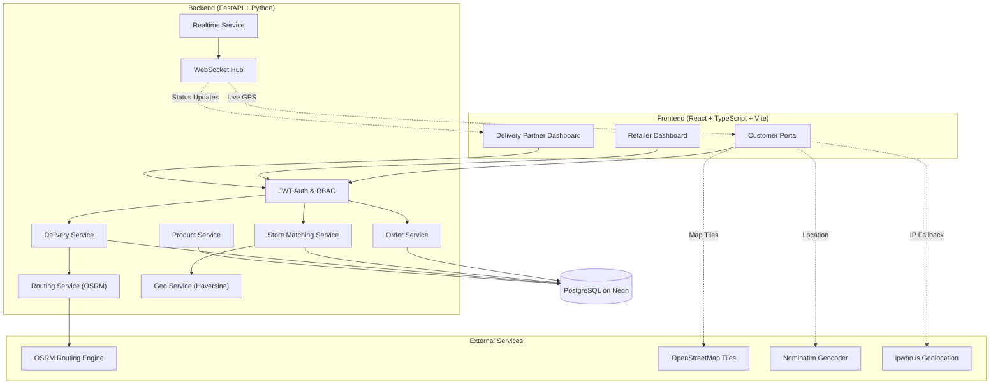
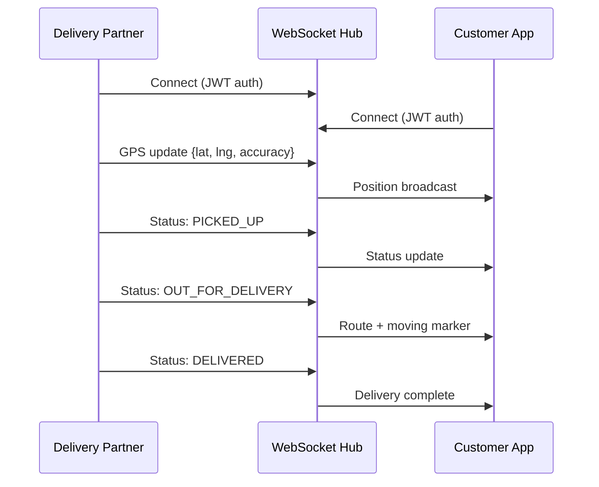

<div align="center">

# 🛒 Dukaan2Door

### Hyperlocal Direct Delivery Platform for Local Retailers

_From neighbourhood store to your doorstep — in minutes._

Customer ordering · Inventory-aware store matching · Retailer fulfillment  
Delivery partner assignment · OSRM route planning · Real-time live tracking

[](backend/)
[](frontend/)
[](https://neon.tech/)
[](https://leafletjs.com/)
[](https://project-osrm.org/)
[](backend/alembic/)
[](#testing)
[](#real-time-tracking)

</div>

---

## Table of Contents

- [Overview](#overview)
- [Core Workflow](#core-workflow)
- [System Architecture](#system-architecture)
- [Technology Stack](#technology-stack)
- [Project Structure](#project-structure)
- [Features by Portal](#features-by-portal)
  - [Customer Portal](#-customer-portal)
  - [Retailer Portal](#-retailer-portal)
  - [Delivery Partner Portal](#-delivery-partner-portal)
- [Backend Services](#backend-services)
- [Real-Time Tracking](#real-time-tracking)
- [Data Architecture](#data-architecture)
- [Local Setup](#local-setup)
- [Environment Variables](#environment-variables)
- [Demo Credentials & Walkthrough](#demo-credentials--walkthrough)
- [Testing](#testing)
- [Scripts](#scripts)
- [Deployment](#deployment)
- [Documentation](#documentation)

---

## Overview

**Dukaan2Door** is a hyperlocal grocery and essentials delivery platform that
connects customers with nearby local retailers. A customer selects products,
shares a delivery location, and places an order. The backend selects an eligible
store using distance and inventory checks, while retailer and delivery partner
workflows move the order through fulfillment to delivery — all tracked in real
time on an interactive map.

The platform is designed around a **direct local-store experience** rather than
a large marketplace. It features three dedicated portals — one each for
customers, retailers, and delivery partners — unified by a single login page
with role-based routing.

### Key Highlights

- **Inventory-aware store matching** — 2 km radius, 5 km fallback
- **Complete order lifecycle** — from cart to delivered, with state-machine validation
- **Live delivery tracking** — WebSocket-driven GPS updates on a Leaflet/OSM map
- **OSRM route planning** — real road-network routes with ETA estimation
- **Three full dashboards** — Customer, Retailer, and Delivery Partner
- **Auto-location detection** — HTML5 GPS → IP geolocation → Nominatim fallback chain

---

## Core Workflow

```
┌──────────────────────────────────────────────────────────────────┐
│  CUSTOMER                                                        │
│  📍 Location detection  →  🛍️ Browse & search products           │
│  🛒 Add to cart         →  💳 Checkout with delivery address      │
│  📦 Place order         →  📊 Track order status in real time     │
└──────────────┬───────────────────────────────────────────────────┘
               │
               ▼
┌──────────────────────────────────────────────────────────────────┐
│  BACKEND                                                         │
│  🏪 Match store (2km → 5km)  →  📦 Lock & decrement inventory   │
│  ✅ Validate order            →  🔔 Notify retailer              │
└──────────────┬───────────────────────────────────────────────────┘
               │
               ▼
┌──────────────────────────────────────────────────────────────────┐
│  RETAILER                                                        │
│  📋 View incoming order  →  ✅ Accept order                      │
│  👨‍🍳 Prepare order       →  📦 Mark ready for pickup             │
│  🚴 Assign delivery partner (auto-rank by distance)              │
└──────────────┬───────────────────────────────────────────────────┘
               │
               ▼
┌──────────────────────────────────────────────────────────────────┐
│  DELIVERY PARTNER                                                │
│  📋 View assigned order  →  ✅ Accept delivery                   │
│  🏪 Pick up from store   →  🛵 Start delivery route              │
│  📍 Broadcast live GPS   →  ✅ Mark delivered                     │
└──────────────────────────────────────────────────────────────────┘
```

**Order Lifecycle State Machine:**

```
RECEIVED → ACCEPTED → PREPARING → READY_FOR_PICKUP → ASSIGNED
         → PICKED_UP → OUT_FOR_DELIVERY → DELIVERED
```

---

## System Architecture



---

## Technology Stack

| Layer | Technology |
|---|---|
| **Frontend Framework** | React 18, TypeScript, Vite |
| **Styling** | Tailwind CSS, Lucide Icons |
| **Maps & Geo** | Leaflet, OpenStreetMap tiles, Mapbox GL JS |
| **State Management** | React Context API |
| **Backend API** | Python 3.11+, FastAPI, Pydantic v2 |
| **Database** | PostgreSQL on [Neon](https://neon.tech/), SQLAlchemy ORM |
| **Migrations** | Alembic |
| **Authentication** | JWT tokens, bcrypt password hashing, role-based authorization |
| **Routing Engine** | OSRM (Open Source Routing Machine) |
| **Geocoding** | Nominatim (reverse), ipwho.is (IP fallback) |
| **Real-time** | FastAPI WebSockets, in-memory connection manager |
| **Deployment** | Render web service + Neon PostgreSQL |

---

## Project Structure

```
Dukaan2Door/
├── backend/
│   ├── alembic/                    # Database migrations
│   ├── app/
│   │   ├── api/v1/endpoints/       # REST API endpoints
│   │   │   ├── auth.py             # Login, register, token refresh
│   │   │   ├── orders.py           # Order CRUD, status tracking
│   │   │   ├── deliveries.py       # Delivery assignment & tracking
│   │   │   ├── products.py         # Product catalog & inventory
│   │   │   ├── retailers.py        # Store management
│   │   │   ├── customers.py        # Customer profiles
│   │   │   ├── delivery_partners.py # Partner profiles & availability
│   │   │   ├── matching.py         # Store matching endpoint
│   │   │   ├── uploads.py          # File uploads
│   │   │   └── websocket.py        # WebSocket connections
│   │   ├── core/                   # Config, security, dependencies
│   │   ├── models/                 # SQLAlchemy ORM models
│   │   ├── schemas/                # Pydantic request/response schemas
│   │   ├── services/               # Business logic layer
│   │   │   ├── auth_service.py
│   │   │   ├── order_service.py
│   │   │   ├── delivery_service.py
│   │   │   ├── store_matching_service.py
│   │   │   ├── routing_service.py
│   │   │   ├── geo_service.py
│   │   │   ├── product_service.py
│   │   │   └── realtime_service.py
│   │   └── main.py                 # FastAPI app entry
│   ├── tests/                      # Pytest test suite (40 tests)
│   └── requirements.txt
├── frontend/
│   ├── src/
│   │   ├── components/
│   │   │   ├── customer/           # ProductCard, CartItem, OrderTimeline, LocationModal...
│   │   │   ├── retailer/           # OrderCard, OrderDetailModal, ProductModal, StoreToggle...
│   │   │   ├── delivery/           # ActiveDeliveryCard, StatusControls, LocationTracker...
│   │   │   ├── maps/               # MapView, DeliveryMap, StoreLocationPicker, RadiusMap
│   │   │   ├── layout/             # Shared layout components
│   │   │   └── ui/                 # Reusable UI primitives
│   │   ├── pages/
│   │   │   ├── auth/               # Unified login page
│   │   │   ├── customer/           # 17 pages (Home, Cart, Checkout, Tracking, Orders...)
│   │   │   ├── retailer/           # 10 pages (Dashboard, Orders, Inventory, Store...)
│   │   │   └── delivery/           # 7 pages (Dashboard, Available, Current, Earnings...)
│   │   ├── services/               # API client and service layer
│   │   ├── context/                # Auth & Cart context providers
│   │   ├── types/                  # TypeScript interfaces
│   │   └── App.tsx                 # Router with role-based routing
│   └── package.json
├── scripts/                        # Seeding, ingestion, and E2E story scripts
├── data/                           # Dataset assets and staging
├── docs/                           # Architecture and testing documentation
└── README.md
```

---

## Features by Portal

### 🛍️ Customer Portal

| Feature | Description |
|---|---|
| **Location Detection** | Auto-detect via HTML5 GPS → IP geolocation → manual address entry |
| **Interactive Map** | Leaflet/OSM map for location selection with draggable pin |
| **Product Browsing** | Category filtering, search, availability badges |
| **Store Discovery** | View nearby stores on map with radius overlay |
| **Cart Management** | Add/remove items, quantity selector, running total |
| **Checkout** | Delivery address confirmation, order placement |
| **Order Tracking** | Real-time status timeline with step-by-step progress |
| **Live Map Tracking** | Watch delivery partner move on map in real time |
| **Order History** | Past orders with detail view and status |
| **Profile Management** | Update name, phone, delivery address |

**Customer Pages:** `HomePage`, `LocationPage`, `StorePage`, `ProductListingPage`, `ProductDetailPage`, `SearchPage`, `CartPage`, `CheckoutPage`, `OrderConfirmationPage`, `OrderStatusPage`, `OrderDetailPage`, `OrderHistoryPage`, `LiveTrackingPage`, `ProfilePage`, `NotificationsPage`, `HelpSupportPage`, `RegisterPage`

---

### 🏪 Retailer Portal

| Feature | Description |
|---|---|
| **Dashboard** | Order overview with status filters and quick actions |
| **Order Management** | Accept, prepare, and mark orders ready for pickup |
| **Delivery Dispatch** | Assign delivery partner with auto-ranked suggestions by proximity |
| **Inventory Management** | Add/edit products, update stock levels, toggle availability |
| **Store Settings** | Business hours, store status toggle (open/closed) |
| **Performance Analytics** | Order volume, revenue, and fulfillment metrics |
| **Store Overview** | Map-based store location with delivery radius visualization |

**Retailer Pages:** `RetailerHomePage`, `RetailerDashboard`, `RetailerOrdersPage`, `RetailerInventoryPage`, `RetailerStorePage`, `RetailerStoreOverviewPage`, `RetailerMenuPage`, `RetailerPerformancePage`, `RetailerBusinessSettingsPage`, `RetailerHelpPage`

---

### 🚴 Delivery Partner Portal

| Feature | Description |
|---|---|
| **Dashboard** | Active delivery with status controls, earnings summary |
| **Available Orders** | Browse and claim orders ready for pickup |
| **Active Delivery** | Step-by-step delivery flow with map and route |
| **GPS Broadcasting** | Auto-broadcast location to customer via WebSocket |
| **Status Progression** | Accept → Pick Up → Out for Delivery → Delivered |
| **Earnings Tracker** | Delivery history with earnings breakdown |
| **Profile** | Availability toggle, vehicle info, contact details |

**Delivery Pages:** `DeliveryHomePage`, `DeliveryDashboard`, `AvailableOrdersPage`, `CurrentDeliveryPage`, `DeliveryHistoryPage`, `DeliveryEarningsPage`, `DeliveryProfilePage`

---

## Backend Services

| Service | File | Responsibility |
|---|---|---|
| **Auth** | `auth_service.py` | JWT token generation, password hashing, user validation |
| **Store Matching** | `store_matching_service.py` | 2 km/5 km radius search, inventory-aware store selection |
| **Orders** | `order_service.py` | Order creation, status transitions, ownership validation |
| **Delivery** | `delivery_service.py` | Partner assignment (auto-ranked), delivery state machine, availability |
| **Routing** | `routing_service.py` | OSRM integration for road-network routes, distance, and ETA |
| **Geo** | `geo_service.py` | Haversine distance calculation, coordinate validation |
| **Products** | `product_service.py` | Catalog queries, category filtering, inventory checks |
| **Realtime** | `realtime_service.py` | WebSocket connection manager, event broadcasting |

### API Endpoints

| Group | Base Path | Key Operations |
|---|---|---|
| **Auth** | `/api/v1/auth` | Register, login, token refresh, current user |
| **Orders** | `/api/v1/orders` | Create, list, status update, tracking, store details |
| **Deliveries** | `/api/v1/deliveries` | Assign partner, accept, pickup, deliver, GPS tracking |
| **Products** | `/api/v1/products` | Browse catalog, search, category filter, inventory |
| **Retailers** | `/api/v1/retailers` | Store profile, products, status toggle |
| **Customers** | `/api/v1/customers` | Profile, address, location |
| **Partners** | `/api/v1/delivery-partners` | Profile, availability, location update |
| **Matching** | `/api/v1/matching` | Find eligible store for coordinates + items |
| **WebSocket** | `/ws/delivery/{order_id}` | Real-time delivery GPS and status events |

Full interactive API docs available at `http://localhost:8080/docs` when the backend is running.

---

## Real-Time Tracking

The delivery tracking system uses **authenticated WebSockets** for live updates:

1. **Delivery partner** broadcasts GPS coordinates at regular intervals
2. **Backend** validates and relays position updates to connected clients
3. **Customer** sees a moving marker on a Leaflet/OSM map with route overlay
4. When the rider marks an order `OUT_FOR_DELIVERY`, an automatic **2.5-minute
   simulated road-route drive** begins (OSRM-powered waypoints)
5. Status changes (`PICKED_UP`, `OUT_FOR_DELIVERY`, `DELIVERED`) are broadcast
   in real time



---

## Data Architecture

### Operational Tables

| Table | Purpose |
|---|---|
| `users` | All user accounts with role (customer/retailer/delivery_partner) |
| `customers` | Customer profiles, delivery address, coordinates |
| `retailers` | Retailer profiles linked to stores |
| `stores` | Store name, location, coordinates, opening status |
| `products` | Product catalog (name, category, price, image) |
| `inventory` | Per-store stock levels for each product |
| `orders` | Orders with status, customer, store, and delivery references |
| `order_items` | Line items with product, quantity, and price |
| `delivery_partners` | Partner profiles, vehicle info, availability, coordinates |
| `deliveries` | Delivery records linking orders to partners |
| `delivery_tracking` | GPS breadcrumb trail with timestamps and accuracy |

### Data Ingestion Pipeline

```
External Datasets → Raw Files → Staging Tables → Normalization → Application Tables
```

Source provenance is preserved. The system does not fabricate customer
identities, store coordinates, or operational relationships from external
datasets that don't contain them.

---

## Local Setup

### Prerequisites

- Python 3.11+
- Node.js 18+
- PostgreSQL (or a [Neon](https://neon.tech/) database URL)

### Backend

```bash
cd backend
python -m venv .venv
source .venv/bin/activate        # Linux/macOS
# .\.venv\Scripts\Activate.ps1   # Windows PowerShell
pip install --upgrade pip
pip install -r requirements.txt
cp .env.example .env             # Edit with your DATABASE_URL and secrets
python -m alembic upgrade head
uvicorn app.main:app --reload --port 8080
```

### Frontend

In a second terminal:

```bash
cd frontend
npm install
cp .env.example .env             # Set VITE_MAPBOX_TOKEN if using Mapbox tiles
npm run dev
```

### Access Points

| Service | URL |
|---|---|
| Frontend | http://localhost:3000 |
| API Docs (Swagger) | http://localhost:8080/docs |
| Health Check | http://localhost:8080/health |

> ⚠️ Never commit `.env` files or production credentials.

---

## Environment Variables

### Backend (`backend/.env`)

| Variable | Description | Required |
|---|---|---|
| `DATABASE_URL` | PostgreSQL connection string (Neon or local) | ✅ |
| `JWT_SECRET_KEY` | Secret for JWT token signing | ✅ |
| `ALGORITHM` | JWT algorithm (default: `HS256`) | ✅ |
| `ACCESS_TOKEN_EXPIRE_MINUTES` | Token expiry in minutes | ✅ |
| `CORS_ORIGINS` | Comma-separated allowed origins | ✅ |
| `OSRM_BASE_URL` | OSRM server URL for routing | ✅ |

### Frontend (`frontend/.env`)

| Variable | Description | Required |
|---|---|---|
| `VITE_API_BASE_URL` | Backend API base URL | ✅ |
| `VITE_MAPBOX_TOKEN` | Mapbox public token for map tiles | Optional |

---

## Demo Credentials & Walkthrough

### Quick-Start Accounts

| Portal | Email | Password |
|---|---|---|
| 🛍️ Customer | `rahul@example.com` | `DemoPassword123!` |
| 🏪 Retailer | `satellite.retailer.rahul@example.com` | `DemoPassword123!` |
| 🚴 Delivery Partner | `satellite.rider.arjun.3km@example.com` | `DemoPassword123!` |

### End-to-End Demo Flow

```
1. Customer logs in → browses products → adds to cart → checks out
2. Retailer sees new order → accepts → prepares → marks ready for pickup
3. Retailer assigns a delivery partner (auto-ranked by proximity)
4. Delivery partner sees assignment → accepts → picks up order
5. Partner starts route → marks Out for Delivery → GPS tracking begins
6. Customer watches live map with moving delivery marker
7. Partner arrives → marks Delivered → order complete ✅
```

### Seed Demo Data

```bash
python scripts/seed_dashboard_accounts.py --allow-remote
python scripts/seed_satellite_catalog.py --allow-remote
```

See [Testing Users and Flow](docs/testing-users-and-flow.md) for the full
credential table and step-by-step browser walkthrough.

---

## Testing

### Backend Unit & Integration Tests

```bash
cd backend
python -m pytest -q
```

**Result:** `40 passed` ✅

Test coverage includes:
- API endpoint validation
- Order state machine transitions
- Authentication and authorization
- Backend integration workflows
- Security checks

### Compile Check

```bash
python -m compileall -q backend/app backend/tests scripts
```

### End-to-End API Story

Run while the backend is serving:

```bash
python scripts/run_story.py
```

Creates isolated accounts, products, inventory, orders — walks the complete
retailer and delivery lifecycle, sends tracking updates, and verifies role
visibility. Refuses non-local URLs unless `--allow-remote` is supplied.

---

## Scripts

| Script | Purpose |
|---|---|
| `seed_dashboard_accounts.py` | Create demo customer, retailer, and delivery partner accounts |
| `seed_satellite_catalog.py` | Populate the demo store with products and inventory |
| `seed_operational_demo.py` | Full operational demo setup |
| `run_story.py` | Automated E2E API story (order lifecycle test) |
| `ingest_all.py` | Full data ingestion pipeline |
| `import_bigbasket_to_store.py` | Import BigBasket dataset into store catalog |
| `import_blinkit_to_store.py` | Import Blinkit dataset into store catalog |
| `clean_bigbasket_kirana.py` | Clean and normalize BigBasket kirana data |
| `profile_datasets.py` | Profile and analyze dataset quality |
| `verify_neon_demo_workflow.py` | Verify Neon database demo readiness |
| `verify_blinkit_integration.py` | Validate Blinkit data integration |

---

## Deployment

The backend is a standard FastAPI application designed for **Render** deployment
with a **Neon PostgreSQL** database.

### Production Start Command

```bash
uvicorn app.main:app --host 0.0.0.0 --port $PORT
```

Render supplies `PORT` at runtime.

### Architecture Notes

- WebSocket broadcasting uses **in-memory connection management** — suitable for
  a single service instance
- Multi-instance deployment would require shared pub/sub infrastructure
  (e.g., Redis)
- Database connections use **Neon's serverless driver** with connection pooling
- Frontend can be deployed as a static build (`npm run build`) to any CDN

---

## Documentation

| Document | Description |
|---|---|
| 📚 [Documentation Hub](docs/README.md) | Central index and navigation hub for all project documentation |
| 🔌 [API Reference & WebSockets](docs/api-reference.md) | Full REST API specification, request/response models, and WebSockets |
| 🗄️ [Database Schema & ERD](docs/database-schema.md) | Entity relationship diagrams, table structures, and migrations |
| 💻 [Frontend Architecture](docs/frontend-architecture.md) | 3-Portal UI design, state management, maps, and geolocation |
| 🗺️ [Backend Architecture](docs/backend-architecture.md) | Service layer, store matching algorithms, and state machines |
| 🚀 [Deployment Guide](docs/deployment-guide.md) | Production setup for Render, Neon, Vercel, and OSRM |
| 🧪 [Testing Guide](docs/testing-guide.md) | Step-by-step parallel manual test walkthrough |
| 👥 [Testing Users & Story](docs/testing-users-and-flow.md) | Demo account credentials and automated API test flow |
| ⚡ [Neon Operational Readiness](docs/neon-operational-readiness.md) | Serverless Postgres configuration and readiness checks |
| 📊 [Data Ingestion Pipeline](docs/data-ingestion.md) | External dataset staging, provenance, and data cleaning |

---

<div align="center">

**Built with ❤️ for local retailers and their communities**

[FastAPI](https://fastapi.tiangolo.com/) · [React](https://react.dev/) · [Neon](https://neon.tech/) · [OpenStreetMap](https://www.openstreetmap.org/) · [OSRM](https://project-osrm.org/)

</div>
