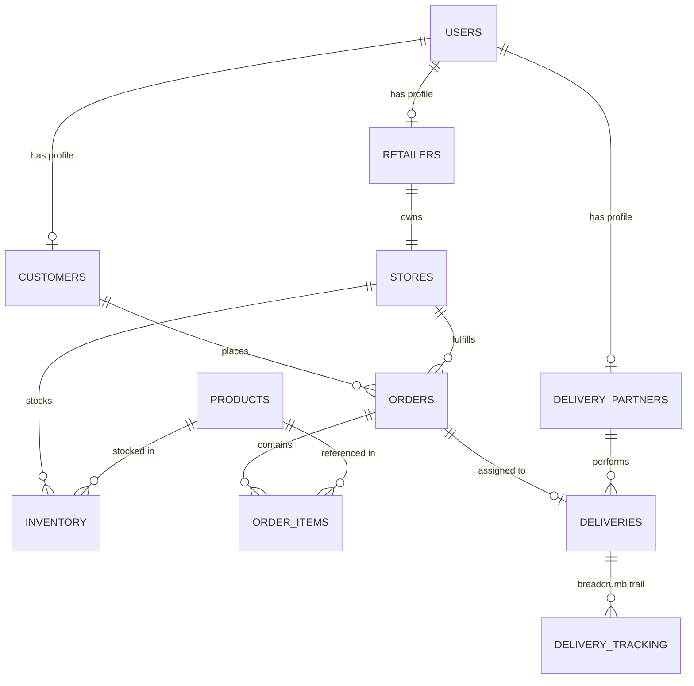

# Dukaan2Door Database Schema & Data Models

Comprehensive guide to the relational database architecture powering Dukaan2Door, implemented with **PostgreSQL on Neon** and managed via **SQLAlchemy ORM** and **Alembic migrations**.

---

## Entity-Relationship Diagram (ERD)



---

## Table Definitions

### 1. `users`
Core user identity and authentication credentials.

| Column | Type | Constraints | Description |
|---|---|---|---|
| `id` | `INTEGER` | `PRIMARY KEY`, `AUTO_INCREMENT` | Unique user identifier |
| `email` | `VARCHAR(255)` | `UNIQUE`, `NOT NULL`, `INDEX` | User email address |
| `hashed_password` | `VARCHAR(255)` | `NOT NULL` | Bcrypt password hash |
| `role` | `VARCHAR(50)` | `NOT NULL` | `customer`, `retailer`, `delivery_partner` |
| `is_active` | `BOOLEAN` | `DEFAULT TRUE`, `NOT NULL` | Account active state |
| `created_at` | `TIMESTAMP WITH TIME ZONE` | `DEFAULT NOW()` | Registration timestamp |

---

### 2. `customers`
Customer demographic, contact, and default delivery coordinates.

| Column | Type | Constraints | Description |
|---|---|---|---|
| `id` | `INTEGER` | `PRIMARY KEY`, `AUTO_INCREMENT` | Customer profile identifier |
| `user_id` | `INTEGER` | `FOREIGN KEY (users.id)`, `UNIQUE` | User identity link |
| `full_name` | `VARCHAR(255)` | `NOT NULL` | Customer name |
| `phone` | `VARCHAR(50)` | `NOT NULL` | Contact telephone number |
| `address` | `TEXT` | `NULLABLE` | Human-readable delivery address |
| `latitude` | `DOUBLE PRECISION` | `NULLABLE` | Default latitude coordinate |
| `longitude` | `DOUBLE PRECISION` | `NULLABLE` | Default longitude coordinate |

---

### 3. `retailers`
Merchant business profiles.

| Column | Type | Constraints | Description |
|---|---|---|---|
| `id` | `INTEGER` | `PRIMARY KEY`, `AUTO_INCREMENT` | Retailer profile identifier |
| `user_id` | `INTEGER` | `FOREIGN KEY (users.id)`, `UNIQUE` | User identity link |
| `business_name` | `VARCHAR(255)` | `NOT NULL` | Legal or operating business name |
| `phone` | `VARCHAR(50)` | `NOT NULL` | Merchant contact number |

---

### 4. `stores`
Physical brick-and-mortar storefronts for local order fulfillment.

| Column | Type | Constraints | Description |
|---|---|---|---|
| `id` | `INTEGER` | `PRIMARY KEY`, `AUTO_INCREMENT` | Store identifier |
| `retailer_id` | `INTEGER` | `FOREIGN KEY (retailers.id)` | Owning retailer |
| `name` | `VARCHAR(255)` | `NOT NULL` | Storefront name (e.g. Apna Kirana Mart) |
| `address` | `TEXT` | `NOT NULL` | Physical store location |
| `latitude` | `DOUBLE PRECISION` | `NOT NULL` | Geolocation latitude |
| `longitude` | `DOUBLE PRECISION` | `NOT NULL` | Geolocation longitude |
| `is_open` | `BOOLEAN` | `DEFAULT TRUE`, `NOT NULL` | Operating switch for matching |
| `delivery_radius_km` | `DOUBLE PRECISION` | `DEFAULT 5.0` | Max fulfillment radius |
| `created_at` | `TIMESTAMP WITH TIME ZONE` | `DEFAULT NOW()` | Record creation timestamp |

---

### 5. `products`
Master product catalog definitions.

| Column | Type | Constraints | Description |
|---|---|---|---|
| `id` | `INTEGER` | `PRIMARY KEY`, `AUTO_INCREMENT` | Product catalog identifier |
| `name` | `VARCHAR(255)` | `NOT NULL`, `INDEX` | Product title |
| `description` | `TEXT` | `NULLABLE` | Detailed description |
| `category` | `VARCHAR(100)` | `NOT NULL`, `INDEX` | Category name (Dairy, Snacks, etc.) |
| `price` | `DOUBLE PRECISION` | `NOT NULL` | Base selling price (INR) |
| `unit` | `VARCHAR(50)` | `NOT NULL` | Unit of measure (e.g., 500g, 1L, 1pc) |
| `image_url` | `VARCHAR(500)` | `NULLABLE` | CDN or static upload URL |
| `is_active` | `BOOLEAN` | `DEFAULT TRUE`, `NOT NULL` | Product visibility flag |

---

### 6. `inventory`
Store-specific stock levels for catalog products.

| Column | Type | Constraints | Description |
|---|---|---|---|
| `id` | `INTEGER` | `PRIMARY KEY`, `AUTO_INCREMENT` | Inventory record identifier |
| `store_id` | `INTEGER` | `FOREIGN KEY (stores.id)`, `INDEX` | Owning store |
| `product_id` | `INTEGER` | `FOREIGN KEY (products.id)`, `INDEX` | Stocked product |
| `quantity` | `INTEGER` | `DEFAULT 0`, `NOT NULL` | Current in-stock quantity |
| `is_available` | `BOOLEAN` | `DEFAULT TRUE`, `NOT NULL` | Stock availability flag |
| `updated_at` | `TIMESTAMP WITH TIME ZONE` | `DEFAULT NOW()` | Last stock update |

*Constraint:* Unique index on `(store_id, product_id)`.

---

### 7. `orders`
Customer orders and fulfillment progress.

| Column | Type | Constraints | Description |
|---|---|---|---|
| `id` | `INTEGER` | `PRIMARY KEY`, `AUTO_INCREMENT` | Order identifier |
| `customer_id` | `INTEGER` | `FOREIGN KEY (customers.id)` | Ordering customer |
| `store_id` | `INTEGER` | `FOREIGN KEY (stores.id)` | Matched fulfillment store |
| `status` | `VARCHAR(50)` | `NOT NULL`, `INDEX` | State machine status |
| `total_amount` | `DOUBLE PRECISION` | `NOT NULL` | Final order grand total (INR) |
| `delivery_address` | `TEXT` | `NOT NULL` | Order destination address |
| `delivery_lat` | `DOUBLE PRECISION` | `NOT NULL` | Drop-off latitude |
| `delivery_lng` | `DOUBLE PRECISION` | `NOT NULL` | Drop-off longitude |
| `payment_method` | `VARCHAR(50)` | `DEFAULT 'COD'` | Payment mode (`COD`, `ONLINE`) |
| `notes` | `TEXT` | `NULLABLE` | Customer instructions |
| `created_at` | `TIMESTAMP WITH TIME ZONE` | `DEFAULT NOW()` | Order placement time |
| `updated_at` | `TIMESTAMP WITH TIME ZONE` | `DEFAULT NOW()` | Last status change |

---

### 8. `order_items`
Individual line items inside an order.

| Column | Type | Constraints | Description |
|---|---|---|---|
| `id` | `INTEGER` | `PRIMARY KEY`, `AUTO_INCREMENT` | Line item identifier |
| `order_id` | `INTEGER` | `FOREIGN KEY (orders.id)`, `INDEX` | Parent order |
| `product_id` | `INTEGER` | `FOREIGN KEY (products.id)` | Purchased product |
| `quantity` | `INTEGER` | `NOT NULL` | Number of units ordered |
| `unit_price` | `DOUBLE PRECISION` | `NOT NULL` | Unit price at time of purchase |
| `subtotal` | `DOUBLE PRECISION` | `NOT NULL` | `quantity * unit_price` |

---

### 9. `delivery_partners`
Riders registered for order pickup and doorstep delivery.

| Column | Type | Constraints | Description |
|---|---|---|---|
| `id` | `INTEGER` | `PRIMARY KEY`, `AUTO_INCREMENT` | Partner profile identifier |
| `user_id` | `INTEGER` | `FOREIGN KEY (users.id)`, `UNIQUE` | User identity link |
| `full_name` | `VARCHAR(255)` | `NOT NULL` | Rider's full name |
| `phone` | `VARCHAR(50)` | `NOT NULL` | Contact phone number |
| `vehicle_type` | `VARCHAR(50)` | `NOT NULL` | Bike, Scooter, Bicycle, Electric |
| `is_available` | `BOOLEAN` | `DEFAULT TRUE`, `INDEX` | Ready for dispatch |
| `current_lat` | `DOUBLE PRECISION` | `NULLABLE` | Last reported latitude |
| `current_lng` | `DOUBLE PRECISION` | `NULLABLE` | Last reported longitude |
| `last_location_time`| `TIMESTAMP WITH TIME ZONE` | `NULLABLE` | Timestamp of last GPS beacon |

---

### 10. `deliveries`
Fulfillment dispatch records connecting an order to a delivery partner.

| Column | Type | Constraints | Description |
|---|---|---|---|
| `id` | `INTEGER` | `PRIMARY KEY`, `AUTO_INCREMENT` | Delivery record identifier |
| `order_id` | `INTEGER` | `FOREIGN KEY (orders.id)`, `UNIQUE` | One-to-one link to order |
| `delivery_partner_id` | `INTEGER` | `FOREIGN KEY (delivery_partners.id)` | Assigned rider |
| `status` | `VARCHAR(50)` | `NOT NULL` | `ASSIGNED`, `PICKED_UP`, `OUT_FOR_DELIVERY`, `DELIVERED` |
| `assigned_at` | `TIMESTAMP WITH TIME ZONE` | `DEFAULT NOW()` | Dispatch timestamp |
| `picked_up_at` | `TIMESTAMP WITH TIME ZONE` | `NULLABLE` | Pickup confirmation timestamp |
| `delivered_at` | `TIMESTAMP WITH TIME ZONE` | `NULLABLE` | Doorstep completion timestamp |

---

### 11. `delivery_tracking`
Append-only GPS breadcrumbs recording rider telemetry during transit.

| Column | Type | Constraints | Description |
|---|---|---|---|
| `id` | `INTEGER` | `PRIMARY KEY`, `AUTO_INCREMENT` | Breadcrumb identifier |
| `delivery_id` | `INTEGER` | `FOREIGN KEY (deliveries.id)`, `INDEX` | Associated delivery |
| `latitude` | `DOUBLE PRECISION` | `NOT NULL` | Recorded latitude |
| `longitude` | `DOUBLE PRECISION` | `NOT NULL` | Recorded longitude |
| `accuracy_meters` | `DOUBLE PRECISION` | `NULLABLE` | Device GPS accuracy estimate |
| `speed_kmh` | `DOUBLE PRECISION` | `NULLABLE` | Travel velocity |
| `recorded_at` | `TIMESTAMP WITH TIME ZONE` | `DEFAULT NOW()` | Recorded timestamp |

---

## Dataset Staging Tables (External Provenance)

To preserve data provenance without polluting the operational runtime:
- `source_datasets`: Metadata for imported external datasets (BigBasket, Blinkit, etc.).
- `source_products`: Raw external product entries before catalog normalization.
- `source_inventory`: Raw merchant product counts before operational store ingestion.
- `source_orders`: Historical training/analytics orders from external sources.

---

## Database Migrations (Alembic)

Migrations are stored under `backend/alembic/versions/`.

### Run Pending Migrations
```bash
cd backend
python -m alembic upgrade head
```

### Generate a New Migration
```bash
python -m alembic revision --autogenerate -m "add_column_name"
```

### Rollback Migration
```bash
python -m alembic downgrade -1
```
