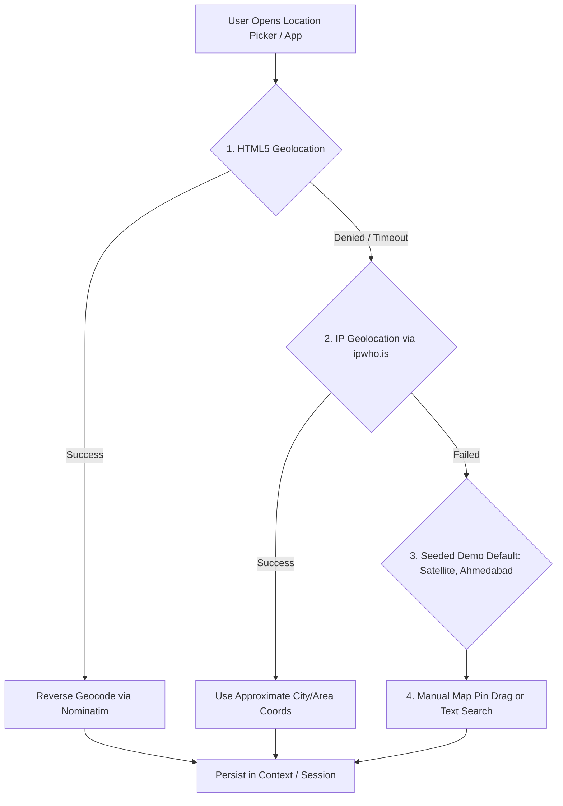

# Dukaan2Door Frontend Architecture

Comprehensive technical guide to the frontend architecture of **Dukaan2Door**, covering the Customer, Retailer, and Delivery Partner portals, state management, mapping engines, geolocation fallback strategies, and real-time synchronization.

---

## 1. System Overview

The frontend is built with **React 18**, **TypeScript**, and **Vite**, using **Tailwind CSS** for responsive styling. It offers a single-page application (SPA) with a unified login gateway that routes users into role-specific portals:

```
                      ┌───────────────────────────┐
                      │   Unified Login (/login)  │
                      └─────────────┬─────────────┘
                                    │
           ┌────────────────────────┼────────────────────────┐
           │                        │                        │
           ▼                        ▼                        ▼
┌─────────────────────┐  ┌─────────────────────┐  ┌─────────────────────┐
│   Customer Portal   │  │   Retailer Portal   │  │   Delivery Portal   │
│   (/customer/*)     │  │   (/retailer/*)     │  │   (/delivery/*)     │
└─────────────────────┘  └─────────────────────┘  └─────────────────────┘
```

---

## 2. Directory Structure

```
frontend/src/
├── components/
│   ├── customer/            # Customer-facing UI components
│   │   ├── CustomerLayout.tsx       # Header with location picker, search, & cart pill
│   │   ├── CustomerOrderCard.tsx    # Order history preview card
│   │   ├── LocationModal.tsx        # Multi-tier location detection modal
│   │   ├── OrderStatusTimeline.tsx  # Step-by-step order lifecycle tracker
│   │   ├── ProductCard.tsx          # Product tile with add/quantity controls
│   │   ├── ProductGrid.tsx          # Responsive catalog grid
│   │   ├── QuantitySelector.tsx     # Increment/decrement input
│   │   └── SearchBar.tsx            # Debounced keyword search input
│   │
│   ├── retailer/            # Merchant-facing UI components
│   │   ├── RetailerLayout.tsx       # Dashboard layout with sidebar navigation
│   │   ├── OrderCard.tsx            # Order card with state progression buttons
│   │   ├── OrderDetailModal.tsx     # Order details, items breakdown, & notes
│   │   ├── ProductModal.tsx         # Add/edit product & inventory form
│   │   └── StoreStatusToggle.tsx    # Open/closed store toggle switch
│   │
│   ├── delivery/            # Rider-facing UI components
│   │   ├── DeliveryPartnerLayout.tsx# Bottom nav bar & header for mobile riders
│   │   ├── ActiveDeliveryCard.tsx   # Active trip details & destination
│   │   ├── DeliveryStatusControls.tsx# Pickup, Out for Delivery, & Delivered CTA
│   │   └── PartnerLocationTracker.tsx# Background GPS broadcaster & simulator
│   │
│   ├── maps/                # Shared mapping & geospatial components
│   │   ├── MapView.tsx              # Dynamic Leaflet / OpenStreetMap container
│   │   ├── DeliveryMap.tsx          # Rider route, store pin, & customer marker
│   │   ├── InteractiveStoreLocationPicker.tsx # Pin drop for address selection
│   │   └── RetailerRadiusMap.tsx    # Store 2km/5km delivery boundary circle
│   │
│   ├── layout/              # Shared structural components
│   │   ├── Navbar.tsx
│   │   ├── Sidebar.tsx
│   │   ├── PageHeader.tsx
│   │   └── ProtectedRoute.tsx       # RBAC route guard
│   │
│   └── ui/                  # Design system primitives (Button, Modal, Badge, Card, etc.)
│
├── context/                 # Application Context Providers
│   ├── AuthContext.tsx      # Authentication state, JWT persistence, & user roles
│   └── CartContext.tsx      # Customer shopping cart & local storage persistence
│
├── pages/                   # Page Views
│   ├── auth/                # Unified Login & Demo Account switchers
│   ├── customer/            # 17 customer pages (Home, Cart, Checkout, Tracking, etc.)
│   ├── retailer/            # 10 retailer pages (Orders, Inventory, Store, Analytics)
│   └── delivery/            # 7 delivery pages (Console, Available Orders, Earnings)
│
├── services/                # API and WebSocket client adapters
│   ├── api.ts               # Axios instance with auth interceptors
│   ├── authService.ts       # Login, register, token refresh
│   ├── customerService.ts   # Catalog, cart, checkout endpoints
│   ├── retailerService.ts   # Store operations & product inventory
│   ├── deliveryService.ts   # Rider availability & order claims
│   └── websocketService.ts  # Real-time WebSocket connection manager
│
└── types/                   # TypeScript interfaces (Order, Product, Store, Delivery, User)
```

---

## 3. State Management

### A. Authentication Context (`AuthContext`)
- Stores current user object, role (`customer`, `retailer`, `delivery_partner`), and JWT token.
- Persists session in `localStorage` under `d2d_token` and `d2d_user`.
- Provides `login()`, `logout()`, and `refreshProfile()` helper methods.
- Automatically attaches `Authorization: Bearer <token>` to all outbound Axios API requests via interceptors.

### B. Shopping Cart Context (`CartContext`)
- Stores active line items, quantities, and subtotal calculations.
- Persists cart locally in `localStorage` (`d2d_cart`).
- Prevents cross-store item mixing by warning customers if items from different merchants are added.

---

## 4. Location Detection & Geocoding Strategy

The customer portal uses a **resilient 4-tier fallback chain** to resolve delivery coordinates:



1. **HTML5 Browser GPS**: High-accuracy latitude and longitude (`navigator.geolocation.getCurrentPosition`).
2. **Reverse Geocoding (Nominatim / OSM)**: Converts GPS coordinates into readable street addresses.
3. **IP Geolocation Fallback (`ipwho.is`)**: Provides city/region approximations when GPS permissions are blocked.
4. **Interactive Map Pin Drop (`InteractiveStoreLocationPicker`)**: Allows customers to drag and place a marker directly on an OpenStreetMap tile canvas.

---

## 5. Map & Routing Integration

The application relies on **100% open-source mapping**:

- **Map Rendering**: [Leaflet](https://leafletjs.com/) with OpenStreetMap (OSM) tile layers for lightweight, zero-cost rendering.
- **Route Geometry & ETA**: Backend **OSRM (Open Source Routing Machine)** integration computes road-network trajectories between store, rider, and customer.
- **Visual Features**:
  - Store marker (🏪)
  - Customer drop-off marker (📍)
  - Live Rider marker (🛵) with animated heading
  - OSRM route polyline
  - GPS accuracy radius circle

---

## 6. Real-Time Tracking & WebSockets

The live tracking interface (`LiveTrackingPage.tsx` and `CurrentDeliveryPage.tsx`) communicates over WebSockets:

- **Connection Endpoint**: `ws://localhost:8080/ws/delivery/{order_id}?token={JWT}`
- **Automatic Reconnection**: Automatically reconnects with exponential backoff on network interruptions.
- **Event Dispatching**:
  - `location_update`: Updates rider pin position and re-centers map.
  - `status_update`: Updates timeline status (`PICKED_UP` → `OUT_FOR_DELIVERY` → `DELIVERED`).
- **Simulated Driving Mode**: Includes a road-following simulation mode that demonstrates live driving movement along the OSRM route for demo environments.

---

## 7. Security & Route Protection

All private routes are wrapped in `ProtectedRoute`:

```tsx
<Route
  path="/retailer/*"
  element={
    <ProtectedRoute allowedRoles={['retailer']}>
      <RetailerLayout />
    </ProtectedRoute>
  }
/>
```

- Unauthorized access attempts redirect to `/login` with the attempted path preserved in `state.from`.
- Cross-role access attempts redirect users to their appropriate dashboard home.
